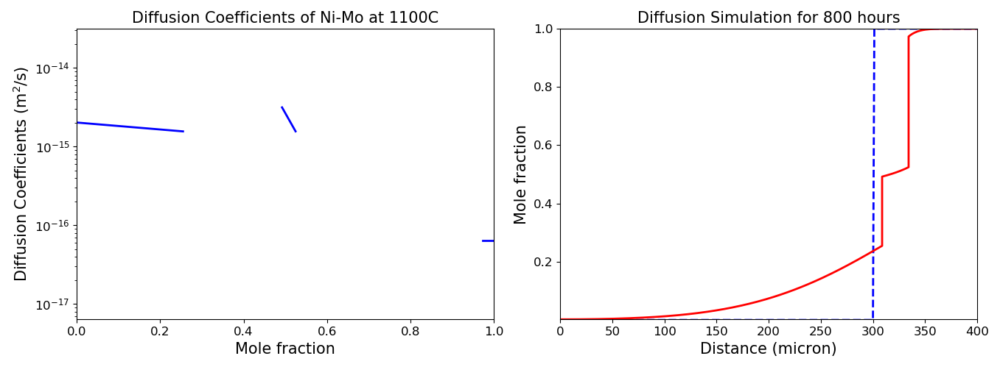
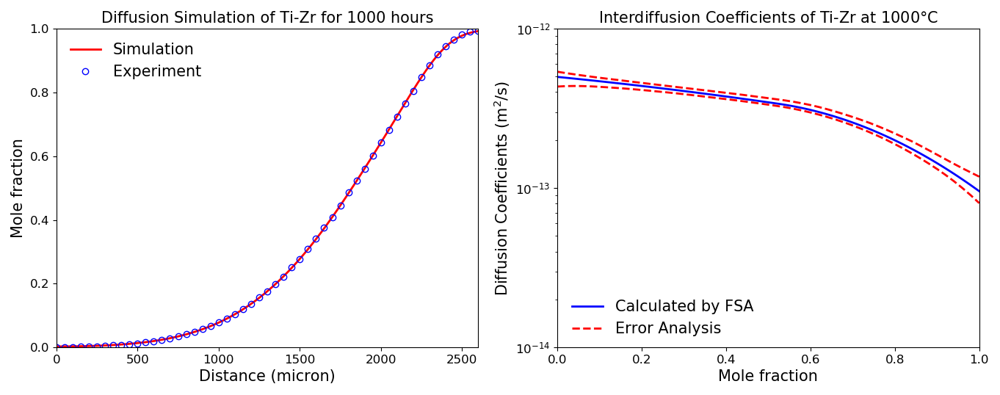

# **pyDiffusion**

**pyDiffusion** combines tools like **diffusion simulation**, **diffusion data smooth**, **forward simulation analysis (FSA)**, etc. to help people analyze diffusion data efficiently.

## Diffusion Simulation

Based on Ni-Mo interdiffusion coefficients data at 1100C, simulate the diffusion process for 1000 hours.

## Error Analysis

The interdiffusion coefficients in Ti-Zr system at 1000C are calculated using FSA. The error bounds of the diffusivity data are estimated using error analysis tool.

