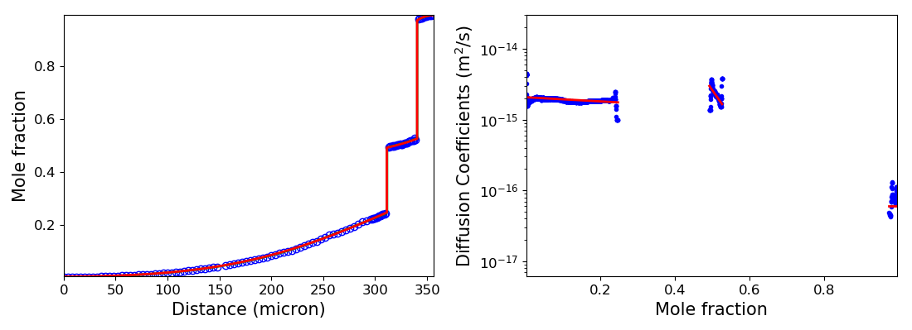
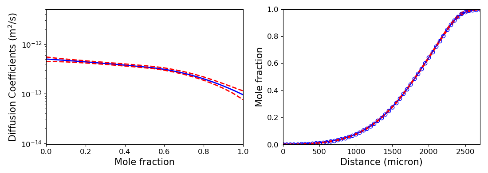

# **pyDiffusion**

**pyDiffusion** combines tools like **diffusion simulation**, **diffusion data smooth**, **forward simulation analysis (FSA)**, etc. to help people analyze diffusion data efficiently.

## Diffusion Simulation

Based on Ni-Mo interdiffusion coefficients data at 1100C, simulate the diffusion process for 800 hours. See [example](docs/examples/DiffusionSimulation.md)

## Forward Simulation Analysis (FSA)

Calculate interdiffusion coefficients of Ni-Mo at 1100C based on raw diffusion data (1000 hours). See [example](docs/examples/ForwardSimulationAnalysis.md)

## Error Analysis

The interdiffusion coefficients in Ti-Zr system at 1000C are calculated using FSA. The error bounds of the diffusivity data are estimated using error analysis tool. See [example](docs/examples/ErrorAnalysis.md)

