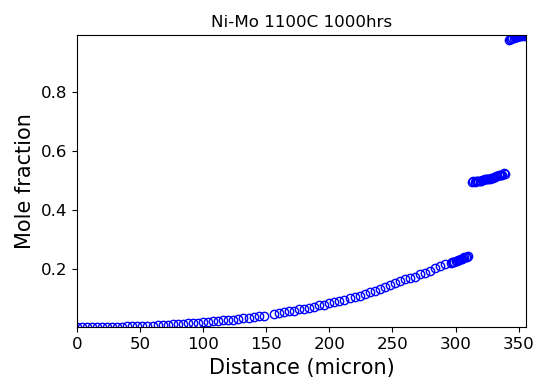
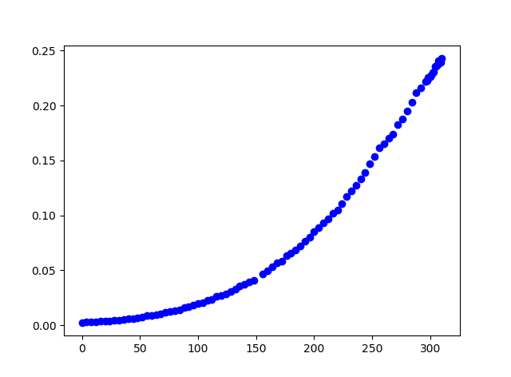
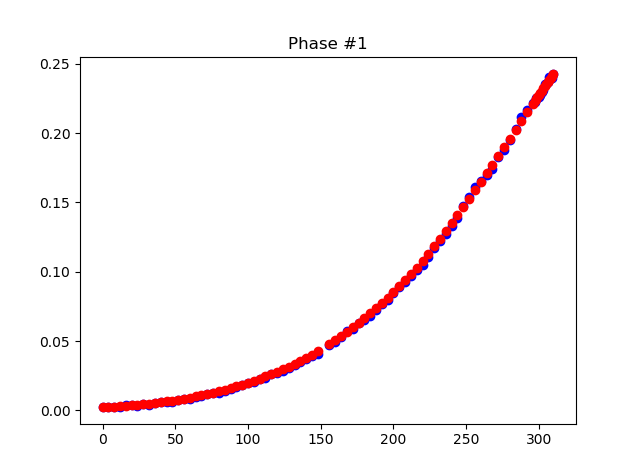
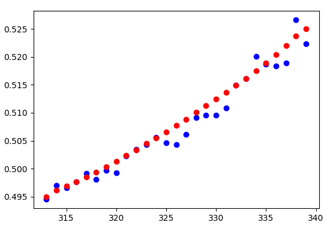
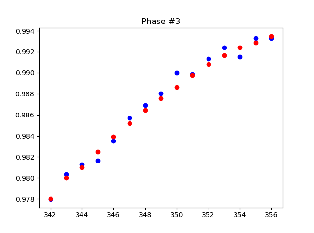
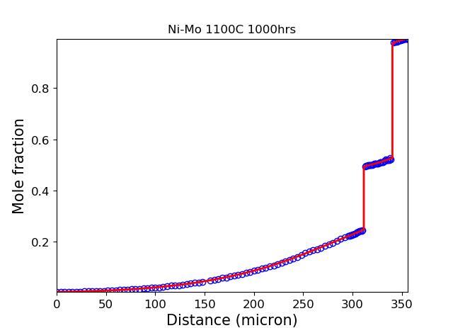

# Data Smoothing

Before any diffusion coefficients calculation, the data smoothing is required for original experimental datasets. This can be implemented by `pydiffusion.smooth.datasmooth`. (Currently doen't support `matplotlib inline`) Here is an example for data smoothing of Ni-Mo 1100C 1000 hours diffusion data.

```python
import matplotlib.pyplot as plt
from pydiffusion.io import read_csv
from pydiffusion.plot import profileplot
from pydiffusion.smooth import datasmooth
```

## Read experimental data

```python
NiMo_exp, _ = read_csv('examples/data/NiMo_exp.csv')
ax = plt.figure(1).add_subplot(111)
ax.set_title('Ni-Mo 1100C 1000hrs')
profileplot(NiMo_exp, ax, c='b', marker='o', ls='none', fillstyle='none')
plt.show(block=False)
```



## Data smoothing

For multiple phases situation, interfaces locations are required as inputs. Ni-Mo has 3 phases at 1100C, 2 interfaces must be provided.

```python
NiMo_sm = datasmooth(NiMo_exp, [311.5, 340.5])
```

The function will smooth 3 phases individually, each phase is smoothed in the following steps:

1. Ask if zoom in is required inside the phase. The zoom in range (start and end location in micron) should be entered.
2. Ask if the start and end composition need to be changed, since the default smoothing won't change the start and end data points.
3. Moving "radius" smoothing, input radius and times. For each data point at location d, its nearby data within [d-r, d+r] are averaged, in which r is the radius in micron.
4. If the smoothing is not good, redo the smoothing.

Profile in each phase will be plotted at first.



```
Enter the zoomed in start and end location, if no, enter nothing

Enter Start and End Composition for this region: [0.00253116433559 0.242800824478]

Smooth Radius and Times: [1 1]
20 2

Redo this smooth? (y/[n])n
Further smooth for this phase? (y/[n])n
```

Phase 1 after smoothing:



```
Enter the zoomed in start and end location, if no, enter nothing

Enter Start and End Composition for this region: [0.49451967118 0.522348614265]
.495 .525
Smooth Radius and Times: [1 1]
10 2
Redo this smooth? (y/[n])n
Further smooth for this phase? (y/[n])n
```

Phase 2 after smoothing:



```
Enter the zoomed in start and end location, if no, enter nothing

Enter Start and End Composition for this region: [0.977964050294 0.993315788947]
.978 .9935
Smooth Radius and Times: [1 1]
5 1
Redo this smooth? (y/[n])n
Further smooth for this phase? (y/[n])n
Data smoothing finished
```

Phase 3 after smoothing:



## Plot data smoothing results

```python
profileplot(NiMo_sm, ax, c='r')
plt.pause(1.0)
plt.show()
```

