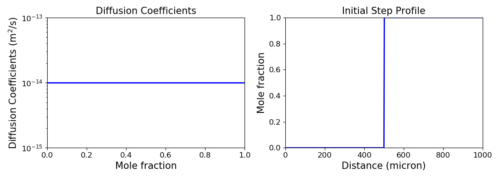
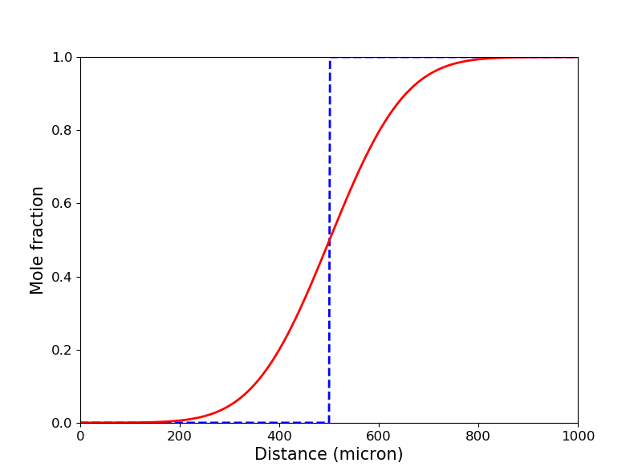
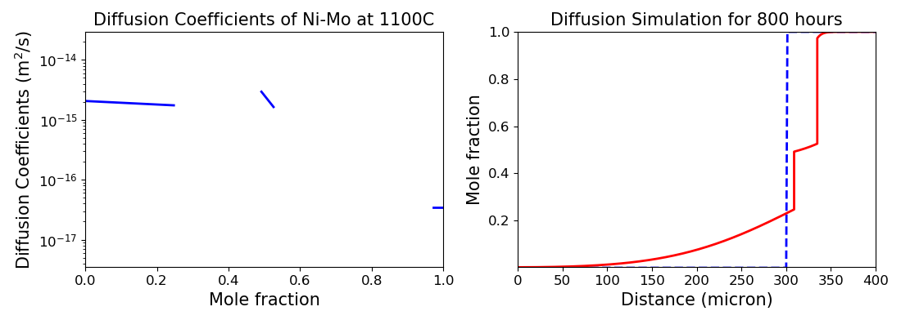

# Diffusion Simulation

Here are few examples of how to use `pydiffusion.mphSim` to perform diffusion simulations.

```python
import numpy as np
import matplotlib.pyplot as plt
import pandas as pd
from pydiffusion.core import DiffSystem
from pydiffusion.utils import step, mesh
from pydiffusion.simulation import mphSim
from pydiffusion.plot import profileplot, DCplot
from pydiffusion.io import read_csv
```

## Diffusion simulation by easy setups

pyDiffusion can simulate simple diffusion systems by easy setups.

Usually, a diffusion simulation requires two inputs:

1. A initial profile (`pydiffusion.core.DiffProfile`)
2. A diffusion system with well-defined diffusion coefficients (`pydiffusion.core.DiffSystem`)

Define a diffusion system with constant diffusion coefficients 10<sup>-14</sup> m<sup>2</sup>/s with concentration range from 0 to 1. To accomplish this, we should create a `DiffSystem` object. Input parameters include `Xr`: solubility range, `X` and `DC`: concentration and corresponding diffusion coefficients data.

```python
diffsys = DiffSystem(Xr=[0, 1], X=[0, 1], DC=[1e-14, 1e-14])
```

Then create a initial step profile (step at 500 micron, length = 1000 micron) before simulation. To accomplish this, function `mesh` is used to mesh grids, and `step` is used to create a step profile upon meshed grids.

```python
dis = mesh(0, 1000, 501)
profile_init = step(dis, 500, diffsys)

fig = plt.figure(figsize=(16, 6))
ax1, ax2 = fig.add_subplot(121), fig.add_subplot(122)
ax1.set_title('Diffusion Coefficients', fontsize=15)
ax2.set_title('Initial Step Profile', fontsize=15)
DCplot(diffsys, ax1)
profileplot(profile_init, ax2)
plt.show()
```



Simulate the diffusion process for 200 hours.

```python
time = 200 * 3600
profile_final = mphSim(profile_init, diffsys, time)
```

Plot the results

```python
ax = plt.figure(figsize=(8, 6)).add_subplot(111)
profileplot(profile_init, ax, ls='--')
profileplot(profile_final, ax, c='r')
plt.show()
```



## Diffusion simulation by reading data of Ni-Mo system

The data required for diffusion simulation is the diffusion coefficients and solubility limits. Here we read concentration dependent diffusion coefficients for Ni-Mo system at 1100 degree C from datafile, and input solubility information mannually.

```python
data = pd.read_csv('NiMo.csv')
X, DC = data['X'], data['DC']
Xr = np.array([[0, 0.25],
               [0.49, 0.53],
               [0.97, 1]])
diffsys_NiMo = DiffSystem(Xr=Xr, X=X, DC=DC)
```

As long as using `1d-array like` type, you can read `X` and `DC` data from any file type.

You can also use `pydiffusion.io.read_csv` to read diffusion coefficients directly from saved data.

```python
_, diffsys_NiMo = read_csv('NiMo.csv', [0, 1])
```

Then create initial step profile as above.

```python
dis = mesh(0, 400, 301)
profile_NiMo_init = step(dis, 300, diffsys_NiMo)
```

Perform diffusion simulation for 800 hours.

```python
profile_NiMo = mphSim(profile_NiMo_init, diffsys_NiMo, 800*3600)
```

Plot results

```python
fig = plt.figure(figsize=(16, 6))
ax1, ax2 = fig.add_subplot(121), fig.add_subplot(122)
ax1.set_title('Diffusion Coefficients of Ni-Mo at 1100C', fontsize=15)
ax2.set_title('Diffusion Simulation for 800 hours', fontsize=15)
DCplot(diffsys_NiMo, ax1)
profileplot(profile_NiMo_init, ax2, ls='--')
profileplot(profile_NiMo, ax2, c='r')
plt.show()
```


